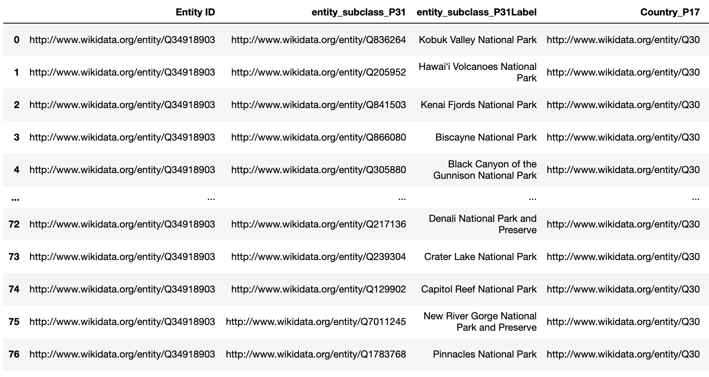
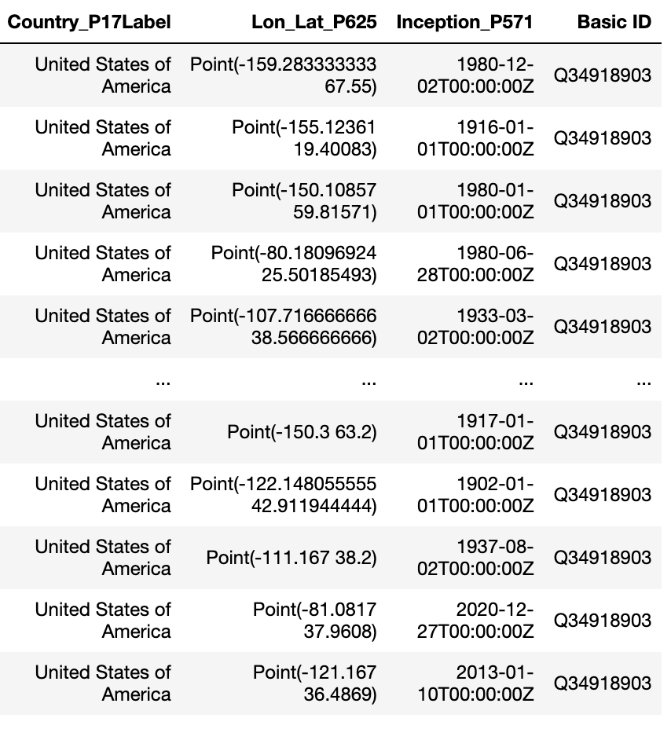
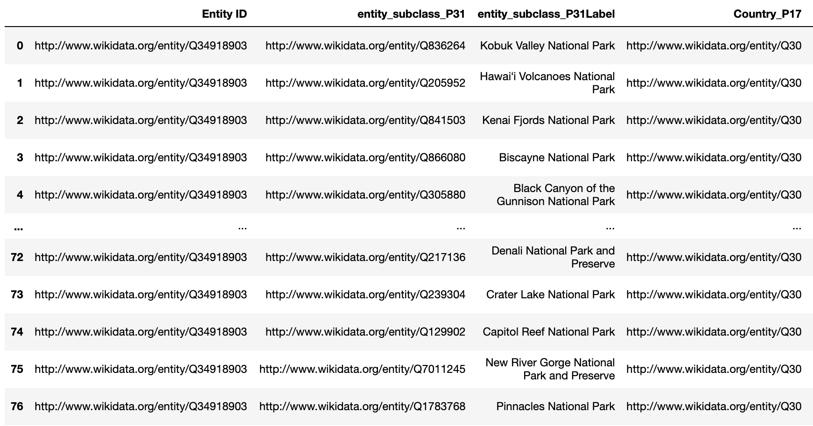
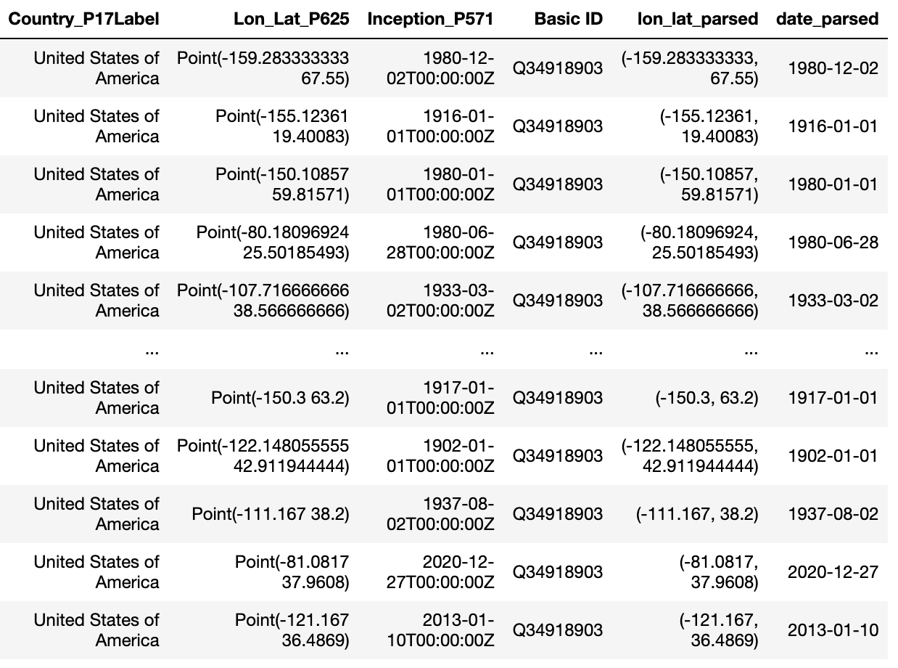
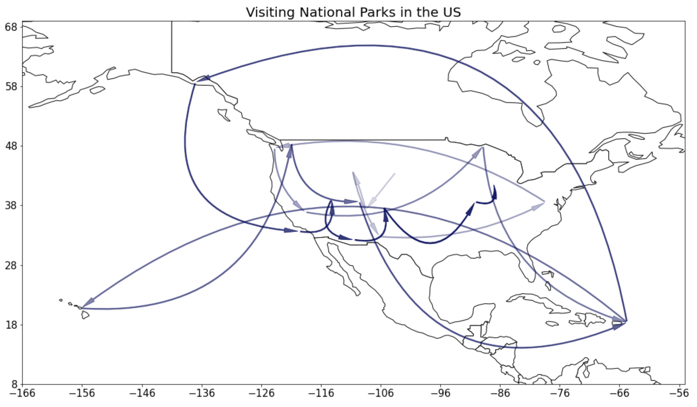
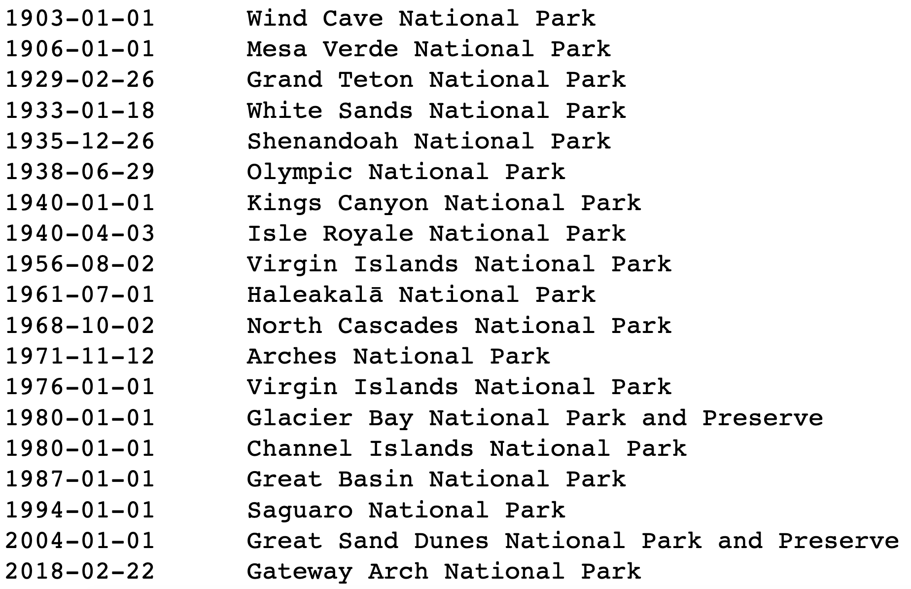

# The Knowledge Client

This document describes the __Knowledge Client__, and how to use it to build data-powered applications very quickly.

The main goal of the __Knowledge Client__ is to allow users to quickly obtain a high-quality relation, on any topic.  It is intended for integration into applications or data science workflows.  The client obtains its data from the backing [__Universal Knowledge Collaboration Network__](sharingservice.md).  Users may have to consult the __UKCN__ in order to find the right identifiers for data objects and properties.

The current client is written in Python, though there is nothing    Python-specific about it: future clients could be written to integrate with programs in Go, Rust, Swift, etc.

## Data Model
A relation in both the __Knowledge Client__ and the __UKCN__ is akin to a traditional RDBMS relation: it's got rows and columns.  However, our relations differ in two important ways:
1. Each row has a globally-unique identifier. This is roughly similar to the *rowid* that some database systems provide. However, our row ids are globally-unique identifiers.
2. Like a traditional RDBMS, each column has a human-understandable *name* (e.g., "Salary") and a *type* (e.g., "float"). In addition, in our system each column has a *semantic label*. These labels are drawn from a dictionary maintained by the __UKCN__. For example, a column might be annotated by a label */properties/wikidata/P3618*, which indicates "base salary".

## Execution Model
The client allows the programmer to build a single relation at a time.
The sequence of steps that the __Knowledge Client__ performs can be thought of as a single "table initialization step", followed by a series of joins that grow the table's rows and columns.  

Some common kinds of initialization include:
- Creating a table of a single row and a single column. For example, consider a single column that identifies a KG object, with a single row that represents the *Barack Obama* object.
- Creating a table of many rows and a single column. For example, consider a single column that identifies a KG object, with multiple rows that represent members of a class, such as all instances of the *City* object.
- Creating a table that corresponds to a pre-made table in the __UKCN__. For example, the programmer may grab a table of dollar-to-Euro exchange statistics.

After initialization, the user performs a series of joins that potentially add rows and columns to the table. With some naming guidance from the user, the system synthesizes all of the appropriate column metadata for each new row and column.

The system does not try to extract or clean __UKCN__ data at the time of use, apart from a few important exceptions.  At the individual fact level, everything the user sees inside a relation created by the __Knowledge Client__ can be found in the __UKCN__.

The exceptions surround cases when the system believes that facts in the __UKCN__ are correct at the individual level, but will yield a relation that is internally inconsistent.  Unfortunately, this is a well-known problem in knowledge graphs. Consider the example that *Tim Berners-Lee* is an example of *Computer Scientist*, while *Computer Scientist* is an example of *profession*. A __Knowledge Client__ user trying to create a table of professions might inadvertently obtain one that includes *Tim Berners-Lee*.  When appropriate, the __Knowledge Client__ will either silently fix these issues, or will issue a warning to the user.

## Basic Usages
__createRelation(entity_id: str, property_id=None, isSubject=None, rowVerbose=None, colVerbose=None,
                   time_property=None, time=None, name=None, label=False, limit=None, subclass=False)__

This function creates a Relation class object.

__Parameters:__

- entity_id: str

    the base Wikidata entity of the Relation (e.g., 'Q30')

- Others:

    The other parameters are the same as those in Relation.extend()

__Relation.extend(self, property_id: str, isSubject: bool, name: str, rowVerbose=False, colVerbose=False, limit=None,
               time_property=None, time=None, search=None, label=False, subclass=False, showid=False)__
               
This function extends a column upon the current focus with a specified property.

__Parameters:__

- property_id: str

    the Wikidata property identifier (e.g., 'P31')
    
- isSubject: bool

    indicates whether the column to be extended is the subject in the (subject->property->object) triple. 
    
    (e.g., If the base entity is 'Q33999' (actor) and the property to extend upon is 'P106' (has occupation), isSubject should be True since we want to find who has an occupation as an actor.)
    
- name: str

    name of the extended column (use underscore for all spaces). The property identifier will be automatically appended in the final result. 
    
    (e.g., If specifying name='population' and property_id='P1082', the column in the dataframe will finally be called 'population_P1082'.)
    
- rowVerbose: bool, default False

    indicates whether all the results of the extended column should be displayed. If rowVerbose=False, it only returns the results with preferred rank.
    
- colVerbose: bool, default False

    indicates whether the qualifiers of the extended column and all the other metadata should be displayed. e.g., If colVerbose=True and property_id='P1082' (population), the time for each population value will be shown as another column, since 'P585' (point in time) is a qualifier associated with 'P1082'.
    
- limit: int, default None

    the max number of rows displayed
    
- time_property: str, default None

    the time qualifier constraint used to select the results. Used with parameter 'time'.
    
- time: int, default None

    specifies the year constraint applied to the qualifier (not property). Used with parameter 'time_property'. e.g., If property_id='P1082' (population), time_property='P585' and time=2010, it will only return the population in 2010.
    
- search: str or pair, default None

    specifies the constraint applied to the property (not qualifier). There are several methods:
    
    - If the search key is search='!NA', it will eliminate the null values in that column.
    
    - If the search key is a Wikidata Entity (e.g., search='Q30'), it will select the rows whose results match.
    
    - If the search key is a tuple of 2 numerical values (e.g., search=(10, 20)), it will select the rows whose results are in this range (both ends included).
    
    - If the search key is a tuple of 2 strings representing years (e.g., search=('2010', '2020')), it will select the rows whose results are in this year range.

- label: bool, default False

    indicates whether an extra column translating Wikidata entity identifiers to semantic labels (e.g., 'Q76' will be translated as Barack Obama).

- subclass: bool, default False

    indicates whether all instances of subclasses are needed. This applies specifically to 'P31'.
    
- showid: bool, default False

    indicates whether the Wikidata entity ID should display alone. If showid=True, 'www.wikidata.org/wiki/Q76' will be displayed as 'Q76' only.

__Relation.changeFocus(self, name="Entity ID")__
               
This function change the focus (column) to be extended with the specified column name.

__Parameters:__

- name: str, default "Entity ID"

    indicates the name of the new focus column we need to extend from. Change the focus using changeFocus before using .extend() function on a different column.

__Relation.query(self)__

This funtion executes the query built by Relation.extend() so far and returns a relation-like dataframe.

__Relation.join(self, df, left: str, right: str, how='inner')__

This funtion joins the relation with an external dateframe.

__Parameters:__

- df: dataframe
    
    The dataframe to be joined with the relation.

- left: str

    The name of the column in the relation to be joined on.

- right: str

    The name of the column in the external dataframe to be joined on.

- how: str, one of {'left', 'right', 'outer', 'inner', 'cross'}, default 'inner'

    Type of join to be performed.

__Relation.extendWithFunction(self, objcolumn, func, name)__

This function adds a column to the relation, similar to what Relation.extend() does, but the column is filled with function outputs instead of information grabbed directly from knowledge graphs. ExtendWithFunction should be called only after Relation.query() has been called.

__Parameters:__

- objcolumn: list

    A list of the column names in the Relation that serve as the inputs of func.

- func: str or function object:

    The function whose outputs will fill the new column. It can be a string that starts with 'F' followed by a number (e.g, 'F10'), which means calling a function published in the function library.

- name: str

    The name of the newly added column.

## Examples

Let's try to show a few examples of using the __Knowledge Client__.

## Tutorial 1: Basic dataset construction with the presidents
__Dinghao, Tian, Kexin: can we add a simple example here?  Just add basic entity data that's already in the knowledge graph.  Presidents, their spouses, and their places and dates of birth. That's it.__

Construct a relation of US presidents, their spouses, their dates of birth and places of births: 

    r = createRelation('Q11696') # Q11696 - 'President of the United States' in wikidata
    r.extend('P39',True, 'President', limit=20, label=True) # P39 - 'position held'
    r.changeFocus('President_P39')
    r.extend('P26', False, 'Spouse', label=True) # P26 - 'spouse'
    r.extend('P569', False, 'date_of_birth', label=True) # P569 - 'date of birth'
    r.extend('P19',False, 'Place_of_birth', label=True) #P19 - 'place of birth'
    r.query()
    r.df
    

## Tutorial 2: Adding numerical data from the European Union
__Dinghao, Tian, Kexin: here let's add a bit more complicated stuff.  The European Union and GDP data.  Then let's do inflation-adjustment for the GDP data.__

Here is an example of all countries in the European Union and their population, as well as the population of the whole Europe:

    r = createRelation('Q458') # Q458 - 'European Union' in wikidata
    r.extend('P150',False,'Countries',label=True) # P150 - 'contains administrative territorial entity'
    r.extend('P1082',False, 'Total_population') # P1082 - 'Population'
    r.changeFocus('Countries_P150')
    r.extend('P1082',False, 'population')
    r.query()
    r.df

Here is another example of inflation-adjusted US GDP data, with the base year of 2014: 

    import math
    def adjustedGDP(gdp: WikiDataProperty(['P2131', 'P2132']), timestamp: WikiDataProperty(['P585'])):
          inflationIndex = pd.read_csv('inflation_data_found_online.csv')
          base = inflationIndex.iloc[-1]['Index']
          timestamp = timestamp[:10]
          inflationIndex.set_index('Date',inplace=True)
          if timestamp in inflationIndex.index:
              return math.floor(float(gdp) / inflationIndex.loc[timestamp]['Index'] * base)
          return math.floor(float(gdp))
          
    usgdp = createRelation('Q30') # Q30 - 'United States of America'
    usgdp.extend('P2131', False, 'GDP', colVerbose=True,rowVerbose=True) # P2131 - 'nominal GDP'
    usgdp.query()
    usgdp.extendWithFunction(['GDP_P2131','GDP_point_in_time_P2131_P585'], adjustedGDP, 'adjustedGDP_P2131') # base 2014
    usgdp.df

## Tutorial 3: Whole-table functions with National Parks data

Here is an example with US National Parks.

    entity_subclass = 'national_park'
    qnum = 'Q34918903' # "National Park of the United States"
    parks = createRelation(qnum, label=True)
    parks.extend('P31', True, 'entity_subclass', label=True) # extend via property P31 = is instance of
    parks.changeFocus('entity_subclass_P31')
    parks.extend('P17', False, 'Country',label=True, search="Q30") # extend via property P17 = is in country
    # parks.extend('P131', False, 'State', label=True)
    parks.extend('P625', False, 'Lon_Lat')
    parks.extend('P571', False, 'Inception')
    parks.query()
    parks.df

The `parse_lon_lats()` function can be used to parse values believed to contain longitude and latitude data.

Input:
- string containing longitude, latitude, and other extraneous characters
    - currently supports input strings formatted in the way Wikidata longitude latitudes are formatted (e.g. the string `Point(-159.28 67.55)`)
- OR longitude latitude tuple
Output:
- (float longitude, float latitude) tuple
- OR string 'NA' if invalid input

    lon_lat_parsed_list = []
    for ind in parks.df.index:
        lon_lat_parsed_list.append(func_lib.parse_lon_lat(parks.df.Lon_Lat_P625[ind]))
    parks.df['lon_lat_parsed'] = lon_lat_parsed_list # add a new column with parsed values

The `parse_dates()` function can be used to parse values believed to contain date data. 

Inputs:
- 20-character-string wikidata format
- OR the 10-character yyyy-mm-dd format
Output:
- 10-character yyyy-mm-dd format
- OR string 'NA' if invalid input

    date_parsed_list = []
    for ind in parks.df.index:
        date_parsed_list.append(func_lib.parse_date(parks.df.Inception_P571[ind]))
    parks.df['date_parsed'] = date_parsed_list # add a new column with parsed values

    parks.df

The `arrow_map()` function can be used to produce a visualization using locations and the associated time stamps. A "travel log" is printed below the plot. `parse_lon_lat()` and `parse_dates()` are called by `arrow_map()` and do not need to be called in advance.

Inputs:
- pandas dataframe from KNP SPARQL relation
- string name of column that contains dates
- string name of column that contains coordinates
- string name of column that contains entity names
- string title for map

    func_lib.arrow_map(parks.df[20:40], 'Inception_P571', 'Lon_Lat_P625', 'entity_subclass_P31Label', 'Visiting National Parks in the US')

## REMINDER: ##
__WE NEED TO FIGURE OUT THE DATA MODEL DISTINCTION BETWEEN USING WIKIDATA VS USING THE SHARING SERVICE.  RIGHT NOW THE CLIENT ONLY EXPLOITS WIKIDATA, BUT THIS SHOULD CHANGE VERY SOON.__
